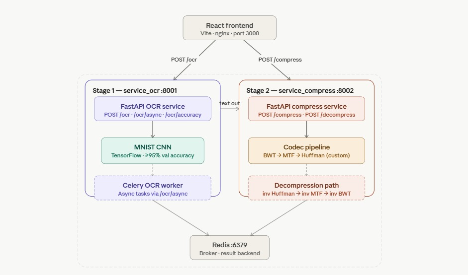

<div align="center">

# 🩺 ReadyAid
### RAG-Based Mobile Health Assistant with LLM Streaming

[](https://python.org)
[](https://fastapi.tiangolo.com)
[](https://kotlinlang.org)
[](https://www.trychroma.com)
[](https://ollama.com)

**Full-stack Android app with a local RAG pipeline delivering real-time, source-grounded medical guidance — built at the Claude × IU Hackathon.**

[📺 Watch Demo](https://www.youtube.com/watch?v=ErKwjnlM1dE) · [🏥 What It Does](#-what-it-does) · [🚀 Quick Start](#-quick-start) · [🏗 Architecture](#-architecture)

</div>

---

## 🏥 What It Does

ReadyAid puts a calm, knowledgeable first-aid assistant in your pocket for the critical minutes before professional help arrives. Unlike generic chatbots, every response is **grounded in curated first-aid documents** via a local RAG pipeline and personalised to the user's medical profile.

| Feature | Description |
|---|---|
| 🤖 **AI First-Aid Chatbot** | Retrieval-augmented, profile-aware responses streamed live token-by-token |
| 🆘 **Emergency SOS Flow** | Countdown + dialer handoff (`ACTION_DIAL`) — user stays in control |
| 👤 **Medical Profile** | Age, conditions, allergies, medications stored locally in Room DB |
| 📖 **Emergency Guide Browser** | Offline-style reference cards for common first-aid scenarios |
| 🎙 **Voice Navigation** | Hands-free intent handling for high-stress moments |
| 🛡 **Safety Guardrails** | Backend rejects non-first-aid queries; escalation language built into every prompt |

> ⚠️ **Disclaimer:** ReadyAid is an educational and assistive tool. It is **not** a substitute for professional medical care. In any emergency, contact local emergency services immediately.

---

## 🏗 Architecture

The diagram below shows the full request lifecycle — from the Android UI through the RAG backend to the streaming LLM response.



### How a query flows end-to-end

```
User query + medical profile
        │
        ▼
  Android (Kotlin / Jetpack Compose)
  ServerRagClient  ──  POST /ask  ──▶  FastAPI (server.py)
                                              │
                              ┌───────────────┼───────────────┐
                              ▼               ▼               ▼
                      Condition         ChromaDB          Safety
                      Detection         Retrieval         Guard
                      (keyword)    (thenlper/gte-small)  (non-medical
                                                          block)
                              └───────────────┼───────────────┘
                                              ▼
                                     Prompt Builder
                                   (profile + context)
                                              │
                                              ▼
                                    Ollama  phi3:mini
                                    (local LLM streaming)
                                              │
                                    NDJSON chunks  ◀────────────┐
                                              │                 │
                                              ▼                 │
                              Android parses RagResponse        │
                              Chat bubble updates live  ────────┘
                              is_finished=true → persist to Room
```

---

## 📁 Repository Structure

```
ReadyAid/
├── ReadyAid/                          # Android app (Kotlin, Compose, Room, Hilt)
│   ├── app/src/main/
│   │   ├── ui/                        # Screens: Chat, SOS, Profile, Guides
│   │   ├── data/                      # Room entities, DAOs, repositories
│   │   ├── network/                   # ServerRagClient (Retrofit / OkHttp)
│   │   └── di/                        # Hilt modules
│   └── app/build.gradle.kts           # RAG_BASE_URL BuildConfig field
│
├── server.py                          # FastAPI RAG backend — POST /ask
├── ingest.py                          # PDF ingestion → embeddings → ChromaDB
├── data/                              # Source first-aid PDFs
├── chroma_index/                      # ChromaDB persistent vector store
├── readyaid_vectors.db                # SQLite chunk metadata store
├── requirements.txt                   # Python dependencies
└── docs/
    └── architecture.jpg               # System architecture diagram
```

---

## 🛠 Tech Stack

### Backend

| Layer | Technology |
|---|---|
| API framework | FastAPI 0.104 + Uvicorn |
| Embeddings | `thenlper/gte-small` via SentenceTransformers |
| Vector store | ChromaDB 0.4 (persistent) |
| LLM | Ollama `phi3:mini` (local, no API key needed) |
| Streaming | NDJSON via `StreamingResponse` |
| PDF ingestion | LangChain + PyPDF |

### Android App

| Layer | Technology |
|---|---|
| Language | Kotlin |
| UI | Jetpack Compose + Navigation Compose |
| Dependency injection | Hilt |
| Local persistence | Room (profile, chat history) |
| Async | Coroutines + Flow |
| Network | Retrofit / OkHttp (NDJSON streaming parser) |

---

## 🚀 Quick Start

### Prerequisites

- Python 3.11+
- [Ollama](https://ollama.com/download) installed and running
- Android Studio (Hedgehog or later)
- An Android emulator or physical device (API 26+)

---

### 1 — Clone the repo

```bash
git clone https://github.com/noopurdiv/ReadyAid.git
cd ReadyAid
```

---

### 2 — Backend setup

```bash
# Create and activate virtual environment
python3 -m venv .venv
source .venv/bin/activate          # Windows: .venv\Scripts\activate

# Install dependencies
pip install -r requirements.txt

# Pull the local LLM (first time only — ~2 GB download)
ollama pull phi3:mini
```

**Build the vector index** (first time only — reads PDFs from `data/`):

```bash
python ingest.py
```

**Start the backend:**

```bash
uvicorn server:app --host 0.0.0.0 --port 8000 --reload
```

The API will be live at `http://localhost:8000`. Visit `http://localhost:8000/docs` for the interactive Swagger UI.

---

### 3 — Android setup

1. Open the `ReadyAid/` folder in **Android Studio**.
2. Let Gradle sync complete.
3. Set the backend URL in `ReadyAid/app/build.gradle.kts`:

```kotlin
// Emulator (Android Virtual Device)
buildConfigField("String", "RAG_BASE_URL", "\"http://10.0.2.2:8000\"")

// Physical device on the same Wi-Fi as your laptop
buildConfigField("String", "RAG_BASE_URL", "\"http://<YOUR_LAPTOP_IP>:8000\"")
```

4. Click **Sync Project with Gradle Files**, then **Run**.

---

## 📡 API Reference

### `POST /ask`

Send a natural-language first-aid query with optional medical profile context.

**Request**

```json
{
  "query": "How do I treat a second-degree burn?",
  "profile": {
    "age": 28,
    "conditions": ["diabetes"],
    "allergies": ["penicillin"],
    "medications": ["metformin"],
    "medical_history": "Type 2 diabetes, diagnosed 2019"
  }
}
```

**Streaming response** — NDJSON, one line per chunk:

```json
{ "response": "Cool the burn under...", "sources": ["RedCross_FirstAid"], "is_first_aid": true, "condition_detected": "burns", "is_finished": false }
{ "response": " lukewarm running water", "sources": ["RedCross_FirstAid"], "is_first_aid": true, "condition_detected": "burns", "is_finished": false }
{ "response": "", "sources": [], "is_first_aid": true, "condition_detected": "burns", "is_finished": true }
```

The Android client reads each NDJSON line, appends `response` to the chat bubble, and finalises the message when `is_finished` is `true`.

---

## 🔒 Safety Design

ReadyAid was built with explicit safeguards at every layer:

| Risk | Safeguard |
|---|---|
| Incorrect medical advice | All responses grounded in retrieved first-aid documents; non-retrieved speculation suppressed |
| Over-reliance on AI | Clear in-app disclaimer; SOS flow escalates to emergency services |
| Non-medical misuse | Backend detects and rejects off-topic queries |
| Sensitive health data | Profile stored locally in Room DB; only minimal payload sent per request |
| Autonomous action without user consent | SOS uses `ACTION_DIAL` — user must confirm the call |

---

## 🧯 Troubleshooting

**`Address already in use` on port 8000**
```bash
lsof -ti :8000 | xargs kill -9
uvicorn server:app --host 0.0.0.0 --port 8000 --reload
```

**Android app cannot reach backend**
- Confirm the server is running and accessible.
- Emulator must use `10.0.2.2`, not `localhost` or `127.0.0.1`.
- Physical device: ensure your laptop IP matches `RAG_BASE_URL` and both devices share the same Wi-Fi.

**Ollama model not found**
```bash
ollama pull phi3:mini
ollama list   # verify phi3:mini appears
```

**Emulator fails to start** (`Not enough space to create userdata partition`)
- Free disk space on the host machine (AVDs need ~4–8 GB).
- In AVD Manager → Wipe Data, or recreate the virtual device.

---

## 🤝 Contributing

Pull requests are welcome. For major changes, please open an issue first to discuss what you'd like to change.

---

## 📄 License

MIT © [Noopur Divekar](https://noopurdiv.github.io)
